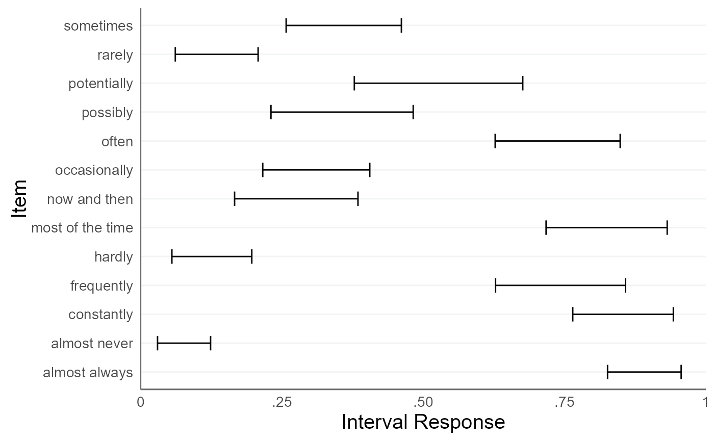

<!-- README.md is generated from README.Rmd. Please edit that file -->

# intervalpsych

<!-- badges: start -->
<!-- badges: end -->

The goal of intervalpsych is to help you with the analysis of interval
responses.

## Installation

You can install the latest version of intervalpsych from
[GitHub](https://github.com/) with:

``` r
# install.packages("devtools")
devtools::install_github("matthiaskloft/intervalpsych")
```

# Fit the Interval Truth Model to the Verbal Quantifiers Dataset

First, we load the verbal quantifiers dataset:

``` r
library(tidyverse)
#> Warning: Paket 'ggplot2' wurde unter R Version 4.4.2 erstellt
#> Warning: Paket 'dplyr' wurde unter R Version 4.4.2 erstellt
#> ── Attaching core tidyverse packages ──────────────────────── tidyverse 2.0.0 ──
#> ✔ dplyr     1.1.4     ✔ readr     2.1.5
#> ✔ forcats   1.0.0     ✔ stringr   1.5.1
#> ✔ ggplot2   3.5.1     ✔ tibble    3.2.1
#> ✔ lubridate 1.9.3     ✔ tidyr     1.3.1
#> ✔ purrr     1.0.2     
#> ── Conflicts ────────────────────────────────────────── tidyverse_conflicts() ──
#> ✖ dplyr::filter() masks stats::filter()
#> ✖ dplyr::lag()    masks stats::lag()
#> ℹ Use the conflicted package (<http://conflicted.r-lib.org/>) to force all conflicts to become errors
library(intervalpsych)


data(quantifiers)

quantifiers <- quantifiers |>
  # exclude control items
  dplyr::filter(!name_en %in% c("always", "never", "fifty-fifty chance")) |>
  # sample 100 respondents
  dplyr::filter(id_person %in% sample(
    size = 100,
    replace = FALSE,
    unique(quantifiers$id_person)
  )) |>
  # exclude missing values
  dplyr::filter(!is.na(x_L) & !is.na(x_U)) |>
  # recompute IDs
  mutate(
    id_person = factor(id_person) |> as.numeric(),
    id_item = factor(id_item) |> as.numeric()
  )

head(quantifiers)
#> # A tibble: 6 × 10
#>   id_person id_item name_ger   name_en truth scale_min scale_max width_min   x_L
#>       <dbl>   <dbl> <chr>      <chr>   <dbl>     <dbl>     <dbl>     <dbl> <dbl>
#> 1         1       1 ab und zu  now an…    NA         0       100         0     6
#> 2         1       2 eventuell  possib…    NA         0       100         0    15
#> 3         1       3 fast immer almost…    NA         0       100         0    89
#> 4         1       4 fast nie   almost…    NA         0       100         0     4
#> 5         1       5 gelegentl… occasi…    NA         0       100         0    16
#> 6         1       6 haeufig    freque…    NA         0       100         0    77
#> # ℹ 1 more variable: x_U <dbl>
```

First, we need to convert the interval responses to the simplex format:

``` r
quantifiers <- cbind(
  quantifiers, 
  itvl_to_splx(quantifiers[,c("x_L","x_U")], min = quantifiers$scale_min, max = quantifiers$scale_max))

head(quantifiers[,9:13])
#>   x_L x_U  x_1  x_2  x_3
#> 1   6  22 0.06 0.16 0.78
#> 2  15  27 0.15 0.12 0.73
#> 3  89  99 0.89 0.10 0.01
#> 4   4  13 0.04 0.09 0.87
#> 5  16  26 0.16 0.10 0.74
#> 6  77  84 0.77 0.07 0.16
```

Let’s check if we can apply the Isometric Log-Ratio transformation:

``` r
try(ilr(quantifiers[,c("x_1","x_2","x_3")]))
#> Error in check_simplex(simplex[i, ], n_elements) : 
#>   Error: None of the elements in the (row-)vector must be exactly 0! Please apply padding first!
```

It seems we have components in our simplex data that are zero. So we
first have to deal with these zero components. We can do this by adding
a padding constant:

``` r
quantifiers[, c("x_1", "x_2", "x_3")] <- 
  remove_zeros(quantifiers[, c("x_1", "x_2", "x_3")], padding = 0.01)

head(quantifiers[,9:13])
#>   x_L x_U        x_1        x_2        x_3
#> 1   6  22 0.06796117 0.16504854 0.76699029
#> 2  15  27 0.15533981 0.12621359 0.71844660
#> 3  89  99 0.87378641 0.10679612 0.01941748
#> 4   4  13 0.04854369 0.09708738 0.85436893
#> 5  16  26 0.16504854 0.10679612 0.72815534
#> 6  77  84 0.75728155 0.07766990 0.16504854
```

``` r
fit <-
  fit_itm(
    df_simplex = quantifiers[, c("x_1", "x_2", "x_3")],
    id_person = quantifiers$id_person,
    id_item = quantifiers$id_item,
    item_labels = quantifiers |> 
      distinct(id_item, name_en) |> 
      pull(name_en),
    n_chains = 2,
    n_cores = 2,
    iter_sampling = 300,
    iter_warmup = 300,
    adapt_delta = .95
  )
#> Warning: Bulk Effective Samples Size (ESS) is too low, indicating posterior means and medians may be unreliable.
#> Running the chains for more iterations may help. See
#> https://mc-stan.org/misc/warnings.html#bulk-ess
#> Warning: Tail Effective Samples Size (ESS) is too low, indicating posterior variances and tail quantiles may be unreliable.
#> Running the chains for more iterations may help. See
#> https://mc-stan.org/misc/warnings.html#tail-ess
```

Now we can extract the estimated cosensus intervals from the fit object:

``` r
consensus <- extract_consensus(fit)
#>                  T_L_median T_L_CI_025 T_L_CI_975 T_U_median T_U_CI_025
#> now and then           0.17       0.15       0.20       0.39       0.35
#> possibly               0.18       0.15       0.22       0.48       0.43
#> almost always          0.85       0.83       0.87       0.98       0.97
#> almost never           0.03       0.02       0.03       0.12       0.10
#> occasionally           0.19       0.16       0.21       0.40       0.36
#> frequently             0.62       0.59       0.65       0.88       0.85
#> hardly                 0.05       0.04       0.06       0.18       0.16
#> sometimes              0.23       0.20       0.26       0.48       0.44
#> most of the time       0.69       0.66       0.72       0.92       0.90
#> often                  0.67       0.64       0.70       0.90       0.88
#> potentially            0.26       0.21       0.31       0.62       0.54
#> rarely                 0.05       0.04       0.06       0.21       0.18
#> constantly             0.79       0.75       0.81       0.96       0.95
#>                  T_U_CI_975
#> now and then           0.42
#> possibly               0.52
#> almost always          0.98
#> almost never           0.14
#> occasionally           0.44
#> frequently             0.90
#> hardly                 0.20
#> sometimes              0.51
#> most of the time       0.93
#> often                  0.92
#> potentially            0.68
#> rarely                 0.23
#> constantly             0.97
```

``` r
plot_intervals(
  df_interval_bounds = consensus$summary[,c("T_L_median", "T_U_median")],
  item_labels = rownames(consensus$summary))
```


