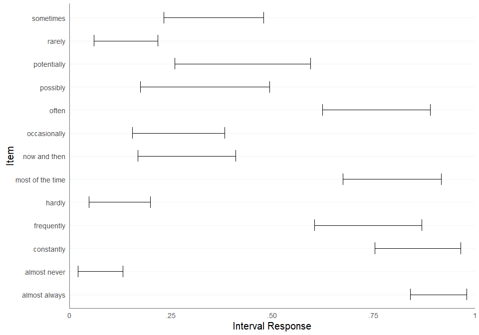
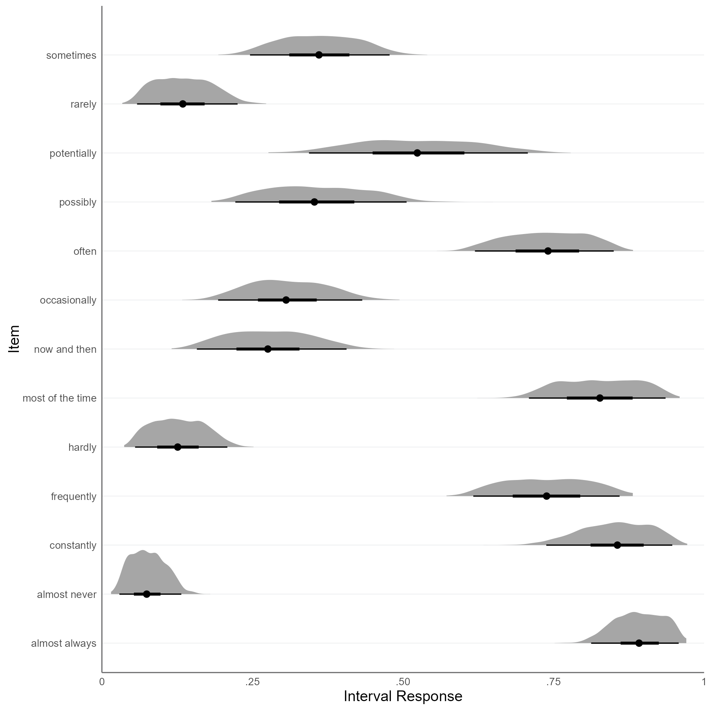

``` r
library(intervalpsych)
```

We want to fit the Interval Consensus Model to the Verbal Quantifiers
dataset.

First, we load the verbal quantifiers dataset:

``` r
packages <- c("dplyr", "kableExtra")
# load packages and install if not available
for (pkg in packages) {
  if (!requireNamespace(pkg, quietly = TRUE)) {
    install.packages(pkg)
  }
  library(pkg, character.only = TRUE)
}


data(quantifiers)

quantifiers <- quantifiers |>
  # exclude control items
  dplyr::filter(!name_en %in% c("always", "never", "fifty-fifty chance")) |>
  # sample 100 respondents
  dplyr::filter(id_person %in% sample(
    size = 30,
    replace = FALSE,
    unique(quantifiers$id_person)
  )) |>
  # exclude missing values
  dplyr::filter(!is.na(x_L) & !is.na(x_U)) |>
  # recompute IDs
  dplyr::mutate(
    id_person = factor(id_person) |> as.numeric(),
    id_item = factor(id_item) |> as.numeric()
  )

head(quantifiers) |> 
  kable(digits = 2) |> 
  kable_styling()
```

<table class="table" style="margin-left: auto; margin-right: auto;">

<thead>

<tr>

<th style="text-align:right;">

id_person
</th>

<th style="text-align:right;">

id_item
</th>

<th style="text-align:left;">

name_ger
</th>

<th style="text-align:left;">

name_en
</th>

<th style="text-align:right;">

truth
</th>

<th style="text-align:right;">

scale_min
</th>

<th style="text-align:right;">

scale_max
</th>

<th style="text-align:right;">

width_min
</th>

<th style="text-align:right;">

x_L
</th>

<th style="text-align:right;">

x_U
</th>

</tr>

</thead>

<tbody>

<tr>

<td style="text-align:right;">

1
</td>

<td style="text-align:right;">

1
</td>

<td style="text-align:left;">

ab und zu
</td>

<td style="text-align:left;">

now and then
</td>

<td style="text-align:right;">

NA
</td>

<td style="text-align:right;">

0
</td>

<td style="text-align:right;">

100
</td>

<td style="text-align:right;">

0
</td>

<td style="text-align:right;">

23
</td>

<td style="text-align:right;">

47
</td>

</tr>

<tr>

<td style="text-align:right;">

1
</td>

<td style="text-align:right;">

2
</td>

<td style="text-align:left;">

eventuell
</td>

<td style="text-align:left;">

possibly
</td>

<td style="text-align:right;">

NA
</td>

<td style="text-align:right;">

0
</td>

<td style="text-align:right;">

100
</td>

<td style="text-align:right;">

0
</td>

<td style="text-align:right;">

7
</td>

<td style="text-align:right;">

97
</td>

</tr>

<tr>

<td style="text-align:right;">

1
</td>

<td style="text-align:right;">

3
</td>

<td style="text-align:left;">

fast immer
</td>

<td style="text-align:left;">

almost always
</td>

<td style="text-align:right;">

NA
</td>

<td style="text-align:right;">

0
</td>

<td style="text-align:right;">

100
</td>

<td style="text-align:right;">

0
</td>

<td style="text-align:right;">

88
</td>

<td style="text-align:right;">

100
</td>

</tr>

<tr>

<td style="text-align:right;">

1
</td>

<td style="text-align:right;">

4
</td>

<td style="text-align:left;">

fast nie
</td>

<td style="text-align:left;">

almost never
</td>

<td style="text-align:right;">

NA
</td>

<td style="text-align:right;">

0
</td>

<td style="text-align:right;">

100
</td>

<td style="text-align:right;">

0
</td>

<td style="text-align:right;">

0
</td>

<td style="text-align:right;">

8
</td>

</tr>

<tr>

<td style="text-align:right;">

1
</td>

<td style="text-align:right;">

5
</td>

<td style="text-align:left;">

gelegentlich
</td>

<td style="text-align:left;">

occasionally
</td>

<td style="text-align:right;">

NA
</td>

<td style="text-align:right;">

0
</td>

<td style="text-align:right;">

100
</td>

<td style="text-align:right;">

0
</td>

<td style="text-align:right;">

30
</td>

<td style="text-align:right;">

57
</td>

</tr>

<tr>

<td style="text-align:right;">

1
</td>

<td style="text-align:right;">

6
</td>

<td style="text-align:left;">

haeufig
</td>

<td style="text-align:left;">

frequently
</td>

<td style="text-align:right;">

NA
</td>

<td style="text-align:right;">

0
</td>

<td style="text-align:right;">

100
</td>

<td style="text-align:right;">

0
</td>

<td style="text-align:right;">

70
</td>

<td style="text-align:right;">

100
</td>

</tr>

</tbody>

</table>

What does the dataset look like? We can visualize the interval responses
using the `plot_intervals_cumulative` function:

``` r
plot_intervals_cumulative(
  lower = quantifiers$x_L,
  upper = quantifiers$x_U,
  min = quantifiers$scale_min,
  max = quantifiers$scale_max,
  cluster_id = quantifiers$name_en,
  weighted = TRUE
)
#> Warning: Removed 389000 rows containing missing values or values outside the scale range
#> (`geom_vline()`).
```


Next, we need to convert the interval responses to the simplex format:

``` r
quantifiers <- cbind(
  quantifiers, 
  itvl_to_splx(quantifiers[,c("x_L","x_U")], min = quantifiers$scale_min, max = quantifiers$scale_max))

head(quantifiers[,9:13]) |> 
  round(2) |>
  kable() |> 
  kable_styling()
```

<table class="table" style="margin-left: auto; margin-right: auto;">

<thead>

<tr>

<th style="text-align:right;">

x_L
</th>

<th style="text-align:right;">

x_U
</th>

<th style="text-align:right;">

x_1
</th>

<th style="text-align:right;">

x_2
</th>

<th style="text-align:right;">

x_3
</th>

</tr>

</thead>

<tbody>

<tr>

<td style="text-align:right;">

23
</td>

<td style="text-align:right;">

47
</td>

<td style="text-align:right;">

0.23
</td>

<td style="text-align:right;">

0.24
</td>

<td style="text-align:right;">

0.53
</td>

</tr>

<tr>

<td style="text-align:right;">

7
</td>

<td style="text-align:right;">

97
</td>

<td style="text-align:right;">

0.07
</td>

<td style="text-align:right;">

0.90
</td>

<td style="text-align:right;">

0.03
</td>

</tr>

<tr>

<td style="text-align:right;">

88
</td>

<td style="text-align:right;">

100
</td>

<td style="text-align:right;">

0.88
</td>

<td style="text-align:right;">

0.12
</td>

<td style="text-align:right;">

0.00
</td>

</tr>

<tr>

<td style="text-align:right;">

0
</td>

<td style="text-align:right;">

8
</td>

<td style="text-align:right;">

0.00
</td>

<td style="text-align:right;">

0.08
</td>

<td style="text-align:right;">

0.92
</td>

</tr>

<tr>

<td style="text-align:right;">

30
</td>

<td style="text-align:right;">

57
</td>

<td style="text-align:right;">

0.30
</td>

<td style="text-align:right;">

0.27
</td>

<td style="text-align:right;">

0.43
</td>

</tr>

<tr>

<td style="text-align:right;">

70
</td>

<td style="text-align:right;">

100
</td>

<td style="text-align:right;">

0.70
</td>

<td style="text-align:right;">

0.30
</td>

<td style="text-align:right;">

0.00
</td>

</tr>

</tbody>

</table>

Let’s check if we can apply the Isometric Log-Ratio transformation:

``` r
try(ilr(quantifiers[,c("x_1","x_2","x_3")]))
#> Error in check_simplex(simplex[i, ]) : 
#>   Error: None of the elements in the (row-)vector must be exactly 0! Please apply padding first!
```

It seems we have components in our simplex data that are zero. So we
first have to deal with these zero components. We can do this by adding
a padding constant:

``` r
quantifiers[, c("x_1", "x_2", "x_3")] <- 
  remove_zeros(quantifiers[, c("x_1", "x_2", "x_3")], padding = 0.01)

head(quantifiers[,9:13]) |> 
  round(2) |>
  kable() |> 
  kable_styling()
```

<table class="table" style="margin-left: auto; margin-right: auto;">

<thead>

<tr>

<th style="text-align:right;">

x_L
</th>

<th style="text-align:right;">

x_U
</th>

<th style="text-align:right;">

x_1
</th>

<th style="text-align:right;">

x_2
</th>

<th style="text-align:right;">

x_3
</th>

</tr>

</thead>

<tbody>

<tr>

<td style="text-align:right;">

23
</td>

<td style="text-align:right;">

47
</td>

<td style="text-align:right;">

0.23
</td>

<td style="text-align:right;">

0.24
</td>

<td style="text-align:right;">

0.52
</td>

</tr>

<tr>

<td style="text-align:right;">

7
</td>

<td style="text-align:right;">

97
</td>

<td style="text-align:right;">

0.08
</td>

<td style="text-align:right;">

0.88
</td>

<td style="text-align:right;">

0.04
</td>

</tr>

<tr>

<td style="text-align:right;">

88
</td>

<td style="text-align:right;">

100
</td>

<td style="text-align:right;">

0.86
</td>

<td style="text-align:right;">

0.13
</td>

<td style="text-align:right;">

0.01
</td>

</tr>

<tr>

<td style="text-align:right;">

0
</td>

<td style="text-align:right;">

8
</td>

<td style="text-align:right;">

0.01
</td>

<td style="text-align:right;">

0.09
</td>

<td style="text-align:right;">

0.90
</td>

</tr>

<tr>

<td style="text-align:right;">

30
</td>

<td style="text-align:right;">

57
</td>

<td style="text-align:right;">

0.30
</td>

<td style="text-align:right;">

0.27
</td>

<td style="text-align:right;">

0.43
</td>

</tr>

<tr>

<td style="text-align:right;">

70
</td>

<td style="text-align:right;">

100
</td>

<td style="text-align:right;">

0.69
</td>

<td style="text-align:right;">

0.30
</td>

<td style="text-align:right;">

0.01
</td>

</tr>

</tbody>

</table>

``` r
fit <-
  fit_icm(
    df_simplex = quantifiers[, c("x_1", "x_2", "x_3")],
    id_person = quantifiers$id_person,
    id_item = quantifiers$id_item,
    item_labels = quantifiers |> 
      dplyr::distinct(id_item, name_en) |> 
      dplyr::pull(name_en),
    link = "ilr",
    padding = .01,
    n_chains = 4,
    n_cores = 1,
    iter_sampling = 500,
    iter_warmup = 300,
    adapt_delta = .9,
    refresh = 0,
    verbose = TRUE
  )
#> 
#> CHECKING DATA AND PREPROCESSING FOR MODEL 'icm_ilr' NOW.
#> 
#> COMPILING MODEL 'icm_ilr' NOW.
#> 
#> STARTING SAMPLER FOR MODEL 'icm_ilr' NOW.
#> Warning: Bulk Effective Samples Size (ESS) is too low, indicating posterior means and medians may be unreliable.
#> Running the chains for more iterations may help. See
#> https://mc-stan.org/misc/warnings.html#bulk-ess
```

Now we can extract the estimated cosensus intervals from the fit object.
The function returns a list containing the posterior samples and a
summary table of the consensus intervals stemming from the posterior
medians.

``` r
consensus <- extract_consensus(fit, print_summary = FALSE)
attributes(consensus)
#> $names
#> [1] "df_rvar" "summary"
```

If we want to get a summary of the consensus intervals, we can use the
`summary` function, which is a wrapper function around
`extract_consensus`.

``` r
summary(fit) |>
  round(2) |> 
  kable() |> 
  kable_styling()
```

<table class="table" style="margin-left: auto; margin-right: auto;">

<thead>

<tr>

<th style="text-align:left;">

</th>

<th style="text-align:right;">

T_L_median
</th>

<th style="text-align:right;">

T_L_CI_025
</th>

<th style="text-align:right;">

T_L_CI_975
</th>

<th style="text-align:right;">

T_U_median
</th>

<th style="text-align:right;">

T_U_CI_025
</th>

<th style="text-align:right;">

T_U_CI_975
</th>

</tr>

</thead>

<tbody>

<tr>

<td style="text-align:left;">

now and then
</td>

<td style="text-align:right;">

0.19
</td>

<td style="text-align:right;">

0.14
</td>

<td style="text-align:right;">

0.25
</td>

<td style="text-align:right;">

0.41
</td>

<td style="text-align:right;">

0.33
</td>

<td style="text-align:right;">

0.47
</td>

</tr>

<tr>

<td style="text-align:left;">

possibly
</td>

<td style="text-align:right;">

0.18
</td>

<td style="text-align:right;">

0.13
</td>

<td style="text-align:right;">

0.25
</td>

<td style="text-align:right;">

0.48
</td>

<td style="text-align:right;">

0.39
</td>

<td style="text-align:right;">

0.57
</td>

</tr>

<tr>

<td style="text-align:left;">

almost always
</td>

<td style="text-align:right;">

0.85
</td>

<td style="text-align:right;">

0.81
</td>

<td style="text-align:right;">

0.89
</td>

<td style="text-align:right;">

0.97
</td>

<td style="text-align:right;">

0.96
</td>

<td style="text-align:right;">

0.98
</td>

</tr>

<tr>

<td style="text-align:left;">

almost never
</td>

<td style="text-align:right;">

0.02
</td>

<td style="text-align:right;">

0.01
</td>

<td style="text-align:right;">

0.03
</td>

<td style="text-align:right;">

0.11
</td>

<td style="text-align:right;">

0.08
</td>

<td style="text-align:right;">

0.14
</td>

</tr>

<tr>

<td style="text-align:left;">

occasionally
</td>

<td style="text-align:right;">

0.18
</td>

<td style="text-align:right;">

0.13
</td>

<td style="text-align:right;">

0.25
</td>

<td style="text-align:right;">

0.40
</td>

<td style="text-align:right;">

0.33
</td>

<td style="text-align:right;">

0.48
</td>

</tr>

<tr>

<td style="text-align:left;">

frequently
</td>

<td style="text-align:right;">

0.64
</td>

<td style="text-align:right;">

0.59
</td>

<td style="text-align:right;">

0.69
</td>

<td style="text-align:right;">

0.88
</td>

<td style="text-align:right;">

0.83
</td>

<td style="text-align:right;">

0.92
</td>

</tr>

<tr>

<td style="text-align:left;">

hardly
</td>

<td style="text-align:right;">

0.05
</td>

<td style="text-align:right;">

0.04
</td>

<td style="text-align:right;">

0.08
</td>

<td style="text-align:right;">

0.19
</td>

<td style="text-align:right;">

0.15
</td>

<td style="text-align:right;">

0.24
</td>

</tr>

<tr>

<td style="text-align:left;">

sometimes
</td>

<td style="text-align:right;">

0.20
</td>

<td style="text-align:right;">

0.15
</td>

<td style="text-align:right;">

0.25
</td>

<td style="text-align:right;">

0.40
</td>

<td style="text-align:right;">

0.33
</td>

<td style="text-align:right;">

0.47
</td>

</tr>

<tr>

<td style="text-align:left;">

most of the time
</td>

<td style="text-align:right;">

0.71
</td>

<td style="text-align:right;">

0.66
</td>

<td style="text-align:right;">

0.76
</td>

<td style="text-align:right;">

0.92
</td>

<td style="text-align:right;">

0.89
</td>

<td style="text-align:right;">

0.95
</td>

</tr>

<tr>

<td style="text-align:left;">

potentially
</td>

<td style="text-align:right;">

0.66
</td>

<td style="text-align:right;">

0.61
</td>

<td style="text-align:right;">

0.72
</td>

<td style="text-align:right;">

0.86
</td>

<td style="text-align:right;">

0.82
</td>

<td style="text-align:right;">

0.90
</td>

</tr>

<tr>

<td style="text-align:left;">

rarely
</td>

<td style="text-align:right;">

0.34
</td>

<td style="text-align:right;">

0.25
</td>

<td style="text-align:right;">

0.44
</td>

<td style="text-align:right;">

0.60
</td>

<td style="text-align:right;">

0.49
</td>

<td style="text-align:right;">

0.70
</td>

</tr>

<tr>

<td style="text-align:left;">

constantly
</td>

<td style="text-align:right;">

0.04
</td>

<td style="text-align:right;">

0.02
</td>

<td style="text-align:right;">

0.06
</td>

<td style="text-align:right;">

0.18
</td>

<td style="text-align:right;">

0.14
</td>

<td style="text-align:right;">

0.22
</td>

</tr>

<tr>

<td style="text-align:left;">

often
</td>

<td style="text-align:right;">

0.80
</td>

<td style="text-align:right;">

0.73
</td>

<td style="text-align:right;">

0.84
</td>

<td style="text-align:right;">

0.98
</td>

<td style="text-align:right;">

0.96
</td>

<td style="text-align:right;">

0.99
</td>

</tr>

</tbody>

</table>

We can also plot the estimated consensus intervals. The generic function
`plot` calls the function `plot_consensus` with the default method
`median_bounds`.

``` r
plot(fit, method = "median_bounds")
```



We can call the function `plot_consensus` directly for the alternative
plotting method `draws_gradient`. This method plots the consensus
intervals based on the posterior draws. For every posterior draw, a
sample is drawn from a uniform distribution using the respective
interval bounds of the posterior draw as minimum and maximum. The result
is an rvar containing the values from the respective consensus interval,
which is visualized in the plot.

An alternative method is `draws_gradient` which plots the consensus
intervals based on the posterior draws. For every posterior draw, a
sample is drawn from a uniform distribution using the respective
interval bounds of the posterior draw as minimum and maximum. The result
is an rvar containing the values from the respective consensus interval,
which is visualized in the plot. The argument `CI` specifies the
credible interval for this distribution and `CI_gradient` specifies the
credible interval outside which the uncertainty is visualized by a
gradient.

``` r
plot_consensus(fit, method = "draws_distribution", CI = .95)
```


``` r
plot_consensus(fit, method = "draws_distribution", CI = c(.5, .95))
```


